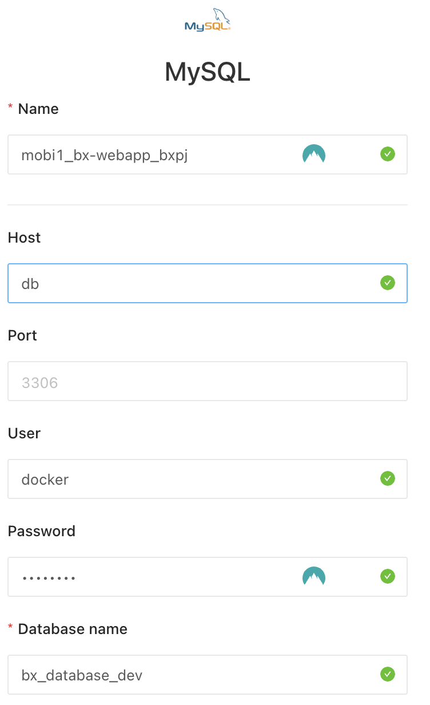

# Redash on local

参考：https://github.com/getredash/setup

## Init
```bash
# pwgen (if you don't have)
brew install pwgen

# create .env file
sh ./setup.sh

# create db
docker-compose run --rm server create_db
```

## RUN
```bash
# run
docker-compose up
```

### Sample

> ## redash account  
> user: admin  
> password: admin_password

